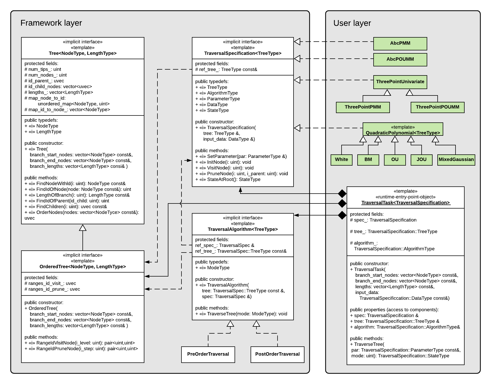

<!-- TODO Add the following to the header:

bibliography: REFERENCES.bib
-->

```{r setup, include=FALSE}
knitr::opts_chunk$set(echo = TRUE)
```

# The **SPLITT** class diagram

The figure below represents a UML class diagram of the **SPLITT** library:


```{r, echo=FALSE, out.width = "792px", out.height = "612px"}

```

The library is divided in two layaers:

- a framework layer defining the main logical and data structures. These include a linear algorithm for initial reordering and splitting of the input tree into generations of nodes, which can be visited in parallel, both during post-order as well as pre-order traversal, and a growing collection of pre-order and post-order traversal algorithms, targeting different parallelization modes (e.g. queue-based versus range-based parallelization) on different computing devices (currently implemented for CPUs only).
- a user layer at which the user of the library must write a `CustomTraversalSpecification` class defining all typedefs and methods of the interface `TraversalSpecification`. The methods that should be defined by the user are:
    - `SetParameter(par)`: sets parameter values, such as model parameters, prior to tree-traversal.
    - `InitNode(i)`: called for each node, *i*, at the beginning of the traversal; performs node-specific initialization, based on the parameter-values and the input data; can be executed both, sequentially or in parallel, depending on the selected parallelization mode; this function is the perfect place to define the calculation of node-specific state fields or other node-specific data, which depend on the parameters, the tree and the input data but do not depend on the state/data associated with other nodes;
    - `VisitNode(i)`: called for the root (in pre-order traversals only) and for every internal and tip node, *i*, (both, pre-order and post-order traversals) after `InitNode(i)` and either after `VisitNode(j)` and `PruneNode(j, i)` has been called for each $j\in Desc(i)$ in post-order traversals, or after `VisitNode($Parent(i))` has been called in pre-order traversals. This method is suitable for implementing the logic in the the function $R_i$, depending on the parameters, the input data, and the state of the nodes, on which *i*'s state depends.
    - `PruneNode(i, i_parent)`: called solely in post-order traversals for every node, *i*, after the call to `VisitNode(i)` and before calling `VisitNode(Parent(i))`. This method is suitable for updating fields associated with `Parent(i)` before it gets visited. It is logically equivalent to leave the implementation of `PruneNode(i, i\_parent)` empty and have the implementation of `VisitNode(i)` consult the states of its daughter nodes. 
    - `StateAtRoot()`: returns the state associated with the root of the tree.

The bridge between the two layers is provided by an object of the `TraversalTask` template class. Once the `TraversalSpecification` implementation has been written, the user instantiates a `TraversalTask` object passing the tree and the input data as arguments. This triggers the creation of the internal objects of the framework, i.e. an `OrderedTree` object maintaining the order in which the nodes are processed and a `PreOrderTraversal` or a `PostOrderTraversal` object implementing  different parallelization modes of the two traversal types. In the ideal use-case, the `TraversalTask`'s `TraverseTree()` method will be called repeatedly,  varying the model parameters, the input data and branch lengths on a fixed tree topology. This encompasses all scenarios where a model is fitted to a fixed tree and data, e.g. ML or Bayesian PCM inference. 

# Packages used
```{r create-references, echo=FALSE, include=FALSE, eval=TRUE}
treeProcessing <- c("ape")
data <- c("data.table")
testing <- c("testthat")

packagesUsed <- c(treeProcessing, data, testing)

printPackages <- function(packs) {
  res <- ""
  for(i in 1:length(packs)) {
    res <- paste0(res, paste0(packs[i], ' v', packageVersion(packs[i]), ' [@R-', packs[i], ']'))
    if(i < length(packs)) {
      res <- paste0(res, ', ')
    }
  }
  res
}

# Write bib information (this line is executed manually and the bib-file is edited manually after that)
#knitr::write_bib(packagesUsed, file = "./REFERENCES-R.bib")
```

Apart from base R functionality, the patherit package uses a number of 3rd party R-packages:

* For tree processing: `r printPackages(treeProcessing)`;
* For reporting: `r printPackages(data)`;
* For testing: `r printPackages(testing)`.

# References

