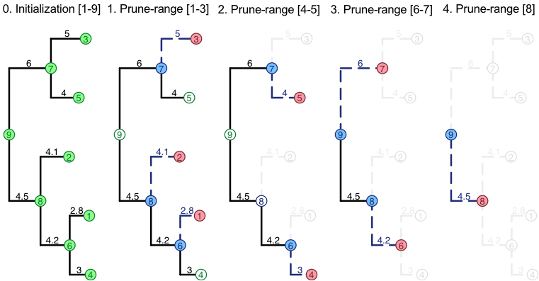

```{r setup, include=FALSE}
knitr::opts_chunk$set(echo = TRUE)
```

# Prune ranges
To maximize the potential for parallel execution SPLITT divides the node-states during a tree traversal into a `InitNode`, a `VisitNode`, and a `PruneNode` operation (see the [Writing a travefsal specification guide](./SPLITTTraversalSpecification.html) for a description). Further, SPLITT rearranges the node-ids (and, hence the data) associated with the nodes in the computer memory, so that the `InitNode` and the `VisitNode` operations can be performed on ranges of consecutive node-ids. Performing these operations on a range of consecutive addresses in the memory has a potential to increase the efficiency of computation, because modern CPUs provide vectorized instruction sets, i.e. low-level processor instructions, such as (addition and multiplication) that can be executed simultaneously on a group of 2, 4 or more consecutive words in the memory. Another benefit from ordering the  operations over such ranges is that the data associated with these nodes will tend to be less fragmented and, therefore, it will be found more often in the processor cache. 

To orchstrate this process SPLITT divides the traversal in a number of phases. The diagram below is an example in which the traversal of a tree is divided into an Initialization phase and four consecutive phases called "prune-ranges":

```{r, echo=FALSE}

```

In each phase, full nodes in green denote parallelizable executed `InitNode`-operations, full nodes in red denote parallelizable `VisitNode` operations and full nodes in blue denote parallelizable `PruneNode` operations. 


In general, there is no arrangement of the nodes in the memory, in which both, the `VisitNode` and the `PruneNode` operations will be executed on ranges of consecutive nodes. For example, the range of daughter-nodes 1, 2, 3 corresponds to the parent nodes 6, 8 and 7. In a bigger tree, the parents could well be nodes 6, 25, 12 or any other non-consecutive ids. Thus, the efficiency of the calculation can, in principle, be affected by the order in which the ranges of `VisitNode`- and `PruneNode`-operations are processed. SPLITT provides several possible arrangements (called "orders" or "parallel models") of the execution cycle of these operations, which are all equivalent with respect to the result of the calculation, but may have different parallel efficiency, depending on the tree and the application-specific traversal operations. 

# Parallel traversal modes during post-order tree traversal

* `AUTO` 0
* `SINGLE_THREAD_LOOP_POSTORDER` 10 
* `SINGLE_THREAD_LOOP_PRUNES` 11
* `SINGLE_THREAD_LOOP_VISITS` 12
* `MULTI_THREAD_LOOP_PRUNES` 21
* `MULTI_THREAD_LOOP_VISITS` 22
* `MULTI_THREAD_LOOP_VISITS_THEN_LOOP_PRUNES` 23
* `MULTI_THREAD_VISIT_QUEUE` 24
* `MULTI_THREAD_LOOP_PRUNES_NO_EXCEPTION` 25
* `HYBRID_LOOP_PRUNES` 31
* `HYBRID_LOOP_VISITS` 32
* `HYBRID_LOOP_VISITS_THEN_LOOP_PRUNES` 33

